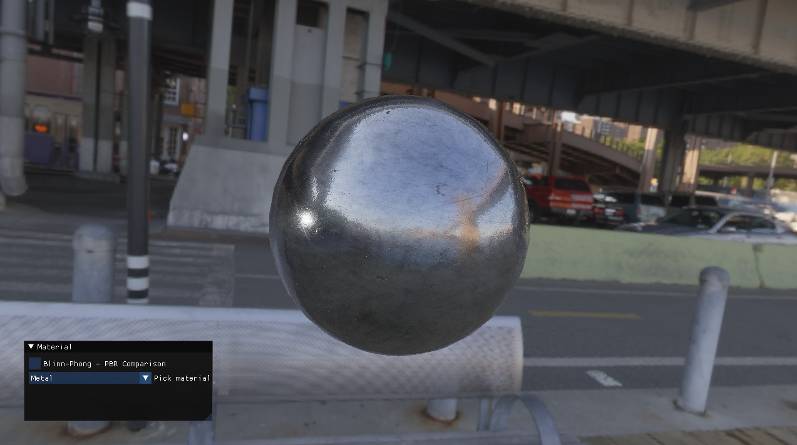

# A 3D graphics programming project.

Done as a part of internship at the Department of Game Technology at Jagiellonian University in Kraków. Contains demonstration of Physically Based Rendering renderer implemented in C++ and OpenGL.



# How to build
After cloning the repository 

```shell
git clone git@github.com:JakubGonera/PBR.git
cd PBR
git submodule init
git submodule update
```

To make this work you need to have the  ssh key added in you github account.
This is the prefered option. If not you can use 
```shell
git clone https://github.com/JakubGonera/PBR/Graphics3D.git
```
and log to you github account when prompted. 

Use CMake to compile:

```shell
mkdir build
cd build
cmake ..
make -j 
./src/Examples/CameraMovement
```

## CLion integration

This projects integrates with CLion IDE "out off the box". Just chose Open project and then choose the project 
directory.

## QTCreator integration

Choose Open project and then choose &lt;project dir&gt;/CMakeLists.txt file. 
